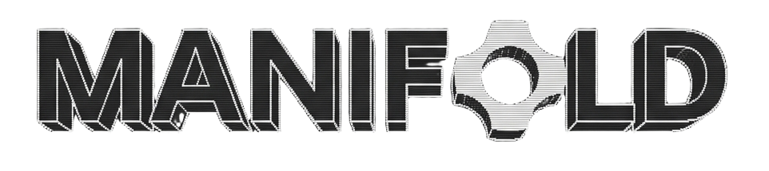

<p align="center">
  
</p>

**Real-time text-to-3D and image-to-3D diffusion with live streaming, powered by [fal.ai](https://fal.ai)**

Manifold lets you turn text prompts or images into 3D models using SAM-3d-objects 3D diffusion, streaming every step as it’s generated. See your ideas take shape as voxels, meshes, and textures—all in an interactive, immersive viewer.

---

## How It Works

1. **Prompt Enhancement** — Groq LLM (`llama-3.3-70b`) rewrites your text into an optimized image prompt + segmentation label
2. **Image Generation** — `fal-ai/z-image/turbo` generates a 3D-ready image in ~1s
3. **3D Reconstruction** — SAM-3D runs geometry and appearance diffusion on H100, streaming voxel data via SSE callbacks at each denoising step
4. **Live Visualization** — React Three Fiber renders voxels/mesh/GLB in real-time as data streams in

For image-to-3D, Groq's vision model (`llama-4-scout`) analyzes the uploaded image to generate the segmentation prompt.

---

## 📋 Prerequisites

- **Node.js** 18+ (for frontend)
- **Python** 3.11 (for serverless development)
- **pnpm** or **npm** (package manager)
- **fal.ai account** with API key
- **Git** with submodule support

---

## 🚀 Quick Start

### 1. Clone the repository

```bash
git clone --recurse-submodules https://github.com/rehan-remade/Manifold.git
cd manifold
```

### 2. Set up the frontend

```bash
cd frontend
npm install   # or pnpm install
```

### 3. Configure environment variables

Create `frontend/.env.local`:
```env
FAL_KEY=your_fal_api_key_here
FAL_ENDPOINT_ID=rehan/sam-3d-stream
GROQ_API_KEY=your_groq_api_key_here  # Optional, for prompt enhancement
```

> **Note:** You can use `rehan/sam-3d-stream` directly, or [deploy your own](#deploy-your-own-endpoint) and update the endpoint ID.

### 4. Start the development server

```bash
npm run dev
```

Open [http://localhost:3000](http://localhost:3000) 🎉

---

### Deploy Your Own Endpoint

Want to customize the SAM-3D backend? Deploy your own:

```bash
# Install fal CLI
pip install fal

# Login to fal
fal auth login
cd serverless
fal deploy sam-3d-stream
```

Then update `FAL_ENDPOINT_ID` in `.env.local` with your new endpoint ID.

---

## 📁 Project Structure

```
frontend/
├── app/
│   ├── page.tsx              # Main orchestrator, layout, state
│   ├── api/
│   │   ├── fal/proxy/        # fal.ai secure proxy (handles API key)
│   │   ├── enhance-prompt/   # Groq LLM prompt enhancement
│   │   └── stream-3d/        # SSE proxy for SAM-3D
│   ├── components/
│   │   ├── VoxelViewer.tsx   # 3D rendering (voxels, mesh, GLB)
│   │   ├── BottomToolbar.tsx # Chat-style input bar
│   │   ├── ViewCube.tsx      # Interactive camera cube
│   │   └── LogPanel.tsx      # Streaming logs drawer
│   ├── hooks/
│   │   └── useSAM3DStream.ts # SSE streaming logic
│   └── lib/
│       ├── types.ts          # TypeScript interfaces
│       ├── decoders.ts       # Base64 binary decoders
│       └── constants.ts      # Stage colors, defaults
└── public/
    └── logo.png              # Manifold logo
```


---

## 🤝 Contributing

1. Fork the repository
2. Create a feature branch: `git checkout -b feature/amazing-feature`
3. Commit your changes: `git commit -m 'Add amazing feature'`
4. Push to the branch: `git push origin feature/amazing-feature`
5. Open a Pull Request

---

<p align="center">
  Built with ❤️ using <a href="https://fal.ai">fal.ai</a>
</p>

